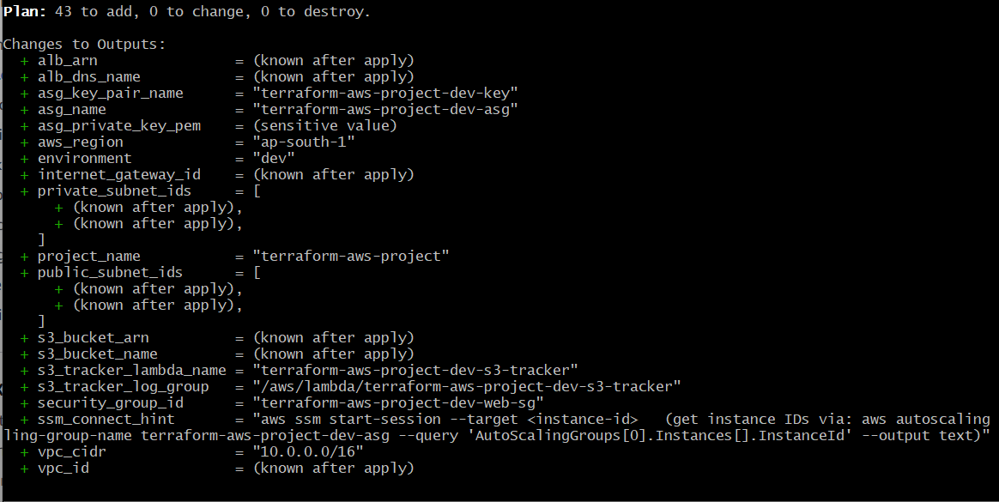
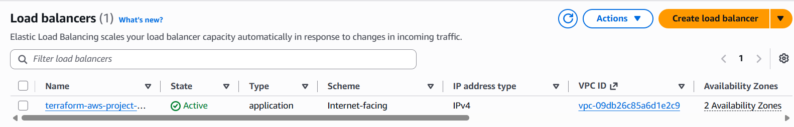
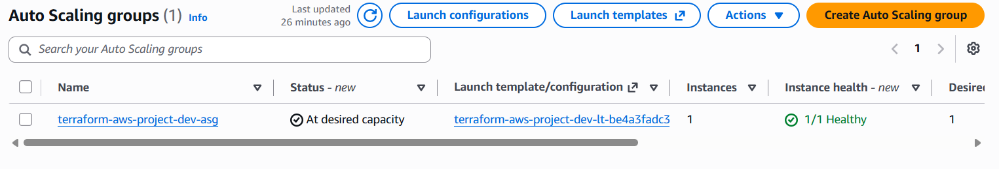
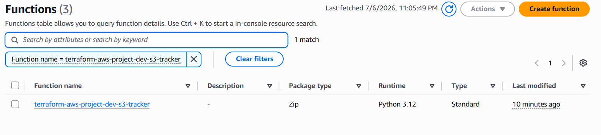
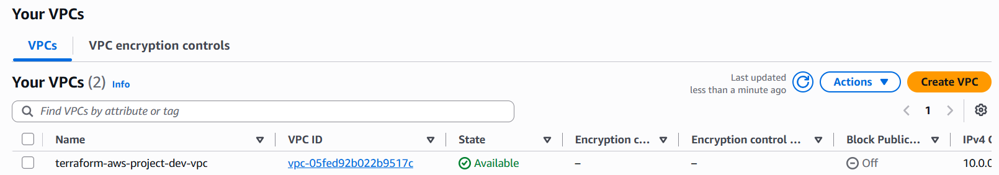
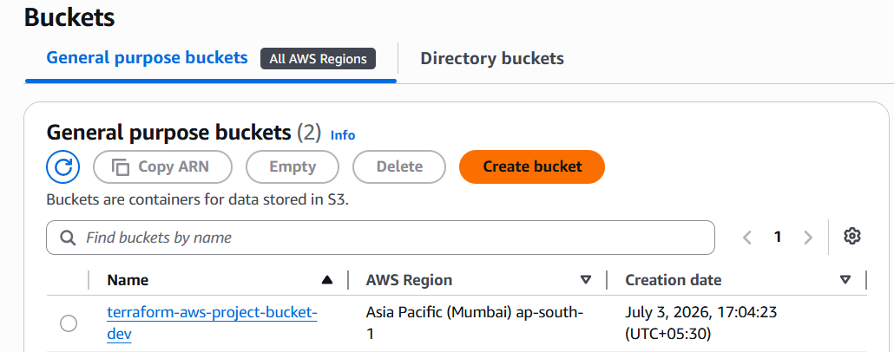
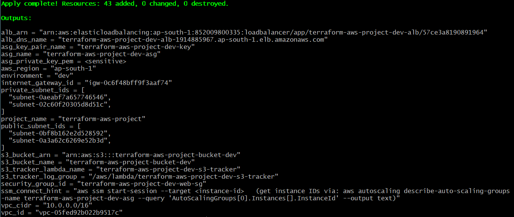

# 🚀 AWS Terraform Multi-Environment Infrastructure Project

**A production-ready Infrastructure-as-Code (IaC) project demonstrating AWS cloud architecture, Terraform best practices, and DevOps expertise.**

---

## 📌 Project Overview

This project demonstrates a **complete, production-grade AWS infrastructure** built entirely with **Terraform**. It showcases:

- ✅ **Modular Architecture** - Reusable components for different environments
- ✅ **Remote State Management** - S3 backend with DynamoDB locking
- ✅ **Multi-Environment Support** - Dev and Production configurations
- ✅ **Security Best Practices** - Encryption, VPC isolation, least-privilege security groups, keyless instance access
- ✅ **High Availability & Auto Scaling** - Application Load Balancer + Auto Scaling Group across multiple AZs
- ✅ **Event-Driven Automation** - Lambda function tracking S3 bucket operations in real time
- ✅ **Keyless Instance Access** - AWS Systems Manager (SSM) Session Manager instead of SSH keys
- ✅ **Infrastructure Automation** - User data for Nginx setup
- ✅ **Professional DevOps Skills** - Clean code, documentation, and reproducibility

### Project Metrics
- **6 Modules** - VPC, Security Groups, S3, ALB, ASG, Lambda S3 Tracker 
- **~35+ AWS Resources** - Fully functional, self-healing infrastructure *(exact count depends on subnet count per environment)*
- **2 Environments** - Dev and Prod configurations
- **Mostly Free Tier** - ALB and Lambda have a small ongoing cost outside the always-free tier; everything else stays within free tier limits

---

## 🏗️ What Was Built

This Terraform project creates a **complete VPC-based infrastructure** with:

### 1. **Network Layer**
- 1 VPC (Virtual Private Cloud)
- 2+ Public Subnets - across multiple AZs (built with `for_each`, keyed by CIDR, so adding/removing a subnet doesn't reshuffle the others)
- 2+ Private Subnets - across multiple AZs, isolated (no default route)
- 1 Internet Gateway
- 2 Route Tables (public & private) + one association per subnet


### 2. **Security Layer**
- 2 Security Groups - act as virtual firewalls, built with the newer split `aws_vpc_security_group_ingress_rule` / `egress_rule` resources (rather than inline blocks) so individual rules can be added/removed without touching the others
  - **Web Security Group** - HTTP (80) and HTTPS (443) open by default; SSH is **not** open by default (see "Connecting to Instances" below - SSM replaces it)
  - **Database Security Group** - MySQL (3306), reachable only from the Web Security Group (SG-to-SG reference, not a CIDR)
  - Egress on both SGs allows all protocols/ports (`-1`), not just TCP - an earlier `tcp`-only egress rule silently blocked UDP traffic like DNS lookups
- **ALB Security Group** - dedicated SG for the load balancer (HTTP 80, optional HTTPS 443)

### 3. **Load Balancing & Compute Layer**
- 1 Application Load Balancer (ALB) - public-facing, spans all public subnets
- 1 Target Group - HTTP health checks against instances
- 1 HTTP Listener (auto-redirects to HTTPS if a certificate is supplied via `acm_certificate_arn`)
- 1 Auto Scaling Group - launches Ubuntu 22.04 instances from a Launch Template, registers them with the ALB target group automatically
- 1 Target-Tracking Scaling Policy - keeps average CPU near a configurable target (default 60-70%), scaling instance count up/down between `asg_min_size` and `asg_max_size`
- AMI resolved automatically via `data "aws_ami"` (latest Ubuntu 22.04 LTS) unless a specific AMI is pinned
- 1 IAM Role + Instance Profile - grants each instance SSM access (see below); no SSH key pair is created by default
- The ASG now owns instance lifecycle end-to-end - it launches, health-checks, replaces, and scales instances without manual intervention.

### 4. **Storage Layer**
- 1 S3 Bucket - For data storage
- Versioning Enabled - Track file changes over time
- Encryption Enabled - Secure data at rest (AES256)
- Public Access Blocked - Security best practice

### 5. **Event-Driven / Serverless Layer**
- 1 Lambda Function (Python 3.12) - triggered on `s3:ObjectCreated:*` and `s3:ObjectRemoved:*`
- 1 S3 Bucket Notification - wires the bucket directly to the Lambda function
- 1 IAM Role + scoped policy - least-privilege access to just this bucket and CloudWatch Logs
- 1 CloudWatch Log Group - every tracked S3 operation (event type, key, size, timestamp) is logged here for audit/observability

---

## 🏛️ Architecture

```
┌───────────────────────────────────────────────────────────────────┐
│                            AWS Cloud                              │
│                                                                   │
│                     Internet (0.0.0.0/0)                          │
│                            │                                      │
│                    ┌───────▼────────┐                             │
│                    │ Application LB │  (ALB Security Group)       │
│                    └───────┬────────┘                             │
│                            │ forwards :80/:443                    │
│  ┌─────────────────────────┼─────────────────────────────────┐    │
│  │                VPC: 10.0.0.0/16 (example - dev)           │    │
│  │                                                           │    │
│  │  ┌──────────────────┐  ┌──────────────────┐               │    │
│  │  │ PUBLIC SUBNET A  │  │ PUBLIC SUBNET B  │   ← Auto      │    │
│  │  │                  │  │                  │     Scaling   │    │
│  │  │ ┌──────────────┐ │  │ ┌──────────────┐ │     Group     │    │
│  │  │ │ ASG Instance │ │  │ │ ASG Instance │ │     (Ubuntu + │    │
│  │  │ │ + Nginx      │ │  │ │ + Nginx      │ │      Nginx)   │    │
│  │  │ │ + SSM Agent  │ │  │ │ + SSM Agent  │ │               │    │
│  │  │ └──────────────┘ │  │ └──────────────┘ │               │    │
│  │  └──────────────────┘  └──────────────────┘               │    │
│  │           ↑ Web Security Group (from ALB, HTTP/HTTPS only)│    │
│  │              [IGW] ←→ Internet                            │    │
│  │                                                           │    │
│  │  ┌──────────────────┐  ┌──────────────────┐               │    │
│  │  │ PRIVATE SUBNET A │  │ PRIVATE SUBNET B │               │    │
│  │  │ (available for   │  │ (available for   │               │    │
│  │  │  databases)      │  │  databases)      │               │    │
│  │  └──────────────────┘  └──────────────────┘               │    │
│  │       ↑ Database Security Group (from Web SG only)        │    │
│  └───────────────────────────────────────────────────────────┘    │
│                                                                   │
│  ┌───────────────────────────────────────────────────────────┐    │
│  │  S3 Bucket (versioned, AES256, public access blocked)     │    │
│  │        │  put / delete object                             │    │
│  │        ▼                                                  │    │
│  │  Lambda: s3-tracker  ──logs──▶  CloudWatch Log Group      │    |
│  └───────────────────────────────────────────────────────────┘    │
│                                                                   │
│           AWS Systems Manager ──▶ Instance                       │
│         aws ssm start-session --target <instance-id>              │
│                                                                   │
└───────────────────────────────────────────────────────────────────┘
```

---

## 📊 Resources Created

#### Network Resources 
- [x] 1 VPC
- [x] N Public Subnets + N Private Subnets (2 each by default, `for_each`-managed)
- [x] 1 Internet Gateway
- [x] 2 Route Tables (public & private)
- [x] 2N Route Table Associations

#### Security Resources 
- [x] 2 Security Groups (web & database) + 1 ALB Security Group
- [x] Ingress rules for HTTP, HTTPS, MySQL (cross-SG), ALB inbound; all-protocol egress on both SGs
- [x] 1 IAM Role + Instance Profile for SSM instance access

#### Load Balancing & Compute Resources
- [x] 1 Application Load Balancer
- [x] 1 Target Group
- [x] 1-2 Listeners (HTTP, optional HTTPS)
- [x] 1 Launch Template
- [x] 1 Auto Scaling Group
- [x] 1 Target-Tracking Scaling Policy

#### Storage Resources
- [x] 1 S3 Bucket
- [x] S3 Versioning Configuration
- [x] S3 Encryption Configuration
- [x] S3 Public Access Block

#### Event-Driven Resources *(new)*
- [x] 1 Lambda Function
- [x] 1 S3 Bucket Notification
- [x] 1 IAM Role + Policy
- [x] 1 CloudWatch Log Group

---

## 🎯 Key Features Demonstrated

### 1. **Modular Terraform Design**
```
modules/
├── vpc/                 → Reusable VPC module (for_each-based subnets)
├── security_groups/     → Reusable security module
├── s3/                  → Reusable storage module
├── alb/                 → Application Load Balancer + target group + listeners
├── asg/                 → Launch template + Auto Scaling Group + scaling policy + SSM role
└── lambda_s3_tracker/   → Event-driven Lambda that logs S3 object operations
```
**Why it matters:** Each module is self-contained, tested independently, and reusable across projects.

### 2. **`for_each` over `count`, everywhere it matters**
Subnets are keyed by their CIDR block, and security group rules are keyed by rule name (flattened per-CIDR), rather than numeric indices. Removing or adding one item no longer forces Terraform to destroy/recreate unrelated resources - a common `count`-based footgun.

### 3. **Remote State Management**
- **Backend:** S3 bucket + DynamoDB
- **Purpose:** Safely store infrastructure state
- **Benefits:**
  - Team collaboration
  - State versioning
  - State locking (prevents conflicts)
  - Disaster recovery

### 4. **Multi-Environment Support**
```
env/
├── dev/dev.tfvars    → Development (smaller instance sizes, tighter ASG limits)
└── prod/prod.tfvars   → Production (larger instances, wider ASG range)
```
**Same code, different configurations** - shows professional DevOps practices.

### 5. **Self-Healing, Auto-Scaling Compute**
The ASG replaces unhealthy instances automatically (via the ALB health check) and scales the fleet size based on real-time CPU load - no manual intervention needed for either failure recovery or traffic spikes.

### 6. **Event-Driven Observability**
Every object created or deleted in the S3 bucket is logged (event type, key, size, timestamp) via Lambda, without needing to enable full S3 access logging or CloudTrail data events.

### 7. **Keyless Instance Access via SSM**
No SSH key pair is generated by default, and port 22 isn't open on the web security group at all. Instead, each instance carries an IAM role scoped to `AmazonSSMManagedInstanceCore`, so access is controlled entirely through IAM policy and every session is logged to CloudTrail - see "Connecting to Instances" below.

### 8. **Infrastructure Provisioning**
```bash
#!/bin/bash
apt-get update -y
apt-get install -y nginx
systemctl start nginx
systemctl enable nginx
```
**User Data Script** automatically installs and configures Nginx on EC2 startup.

---
## 🔌 Connecting to Instances (SSM Session Manager)

Instances are **not** reachable over SSH by default - there's no key pair and no inbound port 22 rule. Instead, connect through AWS Systems Manager:

**1. Find a running instance's ID:**
```bash
aws autoscaling describe-auto-scaling-groups \
  --auto-scaling-group-name terraform-aws-project-dev-asg \
  --query 'AutoScalingGroups[0].Instances[].InstanceId' --output text
```
*(Or just run `terraform output ssm_connect_hint` for this command pre-filled with your project/environment name.)*

**2. Confirm the instance is registered with SSM** (usually ready within a minute or two of boot):
```bash
aws ssm describe-instance-information
```

**3. Start a session - no key, no open port required:**
```bash
aws ssm start-session --target <instance-id>
```

You're now in a root-capable shell on the instance. To exit, type `exit` or `Ctrl+D`.

**Break-glass SSH fallback:** if you ever need old-style SSH (e.g. debugging a broken SSM agent), set `create_key_pair = true` in the `asg` module inputs, re-apply, then retrieve the key with:
```bash
terraform output -raw asg_private_key_pem > key.pem
chmod 400 key.pem
ssh -i key.pem ubuntu@<instance-public-ip>
```
This is intentionally off by default - a single shared private key doesn't give per-person revocation or an audit trail the way SSM does.

---

## 📸 Deployment Results

### Screenshot 1: Terraform Plan Output
**What it shows:** All 43 resources that will be created



```
Terraform will perform the following actions:

Plan: 43 to add, 0 to change, 0 to destroy.

+ alb_arn                   = (known after apply)
+ alb_dns_name              = (known after apply)
+ asg_key_pair_name         = "terraform-aws-project-dev-key"
+ asg_name                  = "terraform-aws-project-dev-asg"
+ asg_private_key_pem       = (sensitive value)
+ aws_region                = "ap-south-1"
+ environment               = "dev"
+ internet_gateway_id       = (known after apply)
+ private_subnet_ids        = [
    + (known after apply),
    + (known after apply),
  ]
+ project_name              = "terraform-aws-project"
+ public_subnet_ids         = [
    + (known after apply),
    + (known after apply),
  ]
+ s3_bucket_arn             = (known after apply)
+ s3_bucket_name            = (known after apply)
+ s3_tracker_lambda_name    = "terraform-aws-project-dev-s3-tracker"
+ s3_tracker_log_group      = "/aws/lambda/terraform-aws-project-dev-s3-tracker"
+ security_group_id         = "terraform-aws-project-dev-web-sg"
+ ssm_connect_hint          = "aws ssm start-session --target <instance-id> (get instance IDs via: aws autoscaling describe-auto-scaling-groups --name terraform-aws-project-dev-asg --query 'AutoScalingGroups[0].Instances[].InstanceId' --output text)"
+ vpc_cidr                  = "10.0.0.0/16"
+ vpc_id                    = (known after apply)

```

---

### Screenshot 2: Application Load Balancer



---

### Screenshot 3:Auto Scaling Group
  


---
### Screenshot 4: Lambda S3 Tracker



---
### Screenshot 5: VPC 



---

### Screenshot 6: S3 Bucket



---

### Screenshot 7: Terraform Outputs
**Console output shows:**

```
Outputs:

alb_arn = "arn:aws:elasticloadbalancing:ap-south-1:852009800335:loadbalancer/app/terraform-aws-project-dev-alb/57ce3a8190891964"
alb_dns_name = "terraform-aws-project-dev-alb-1914885967.ap-south-1.elb.amazonaws.com"

asg_key_pair_name = "terraform-aws-project-dev-key"
asg_name = "terraform-aws-project-dev-asg"

aws_region = "ap-south-1"
environment = "dev"
internet_gateway_id = "igw-0c6f48bff9f3aaf74"

private_subnet_ids = [
  "subnet-0aeabf7a657746546",
  "subnet-02c60f20305d8d51c",
]

project_name = "terraform-aws-project"

public_subnet_ids = [
  "subnet-0bfb8162e2d528592",
  "subnet-0a3a626269e52b3d",
]

s3_bucket_arn = "arn:aws:s3:::terraform-aws-project-bucket-dev"
s3_bucket_name = "terraform-aws-project-bucket-dev"

s3_tracker_lambda_name = "terraform-aws-project-dev-s3-tracker"
s3_tracker_log_group = "/aws/lambda/terraform-aws-project-dev-s3-tracker"

security_group_id = "terraform-aws-project-dev-web-sg"

ssm_connection_command = "aws ssm start-session --target <instance-id> (get instance IDs via: aws autoscaling describe-auto-scaling-groups --name terraform-aws-project-dev-asg --query 'AutoScalingGroups[0].Instances[].InstanceId' --output text)"

vpc_cidr = "10.0.0.0/16"
vpc_id = "vpc-05fed92b022b9517c"

```



---

## 💻 Technologies Used

| Technology | Version | Purpose |
|-----------|---------|---------|
| **Terraform** | >= 1.0 | Infrastructure-as-Code |
| **AWS** | Latest | Cloud provider |
| **Ubuntu 22.04 LTS** | Latest (auto-resolved) | ASG instance OS |
| **Nginx** | Latest | Web server |
| **AWS Systems Manager** | - | Keyless instance access (Session Manager) |
| **AWS Lambda** | Python 3.12 | Event-driven S3 operation tracking |
| **DynamoDB** | On-demand | State locking |
| **S3** | Latest | State storage & data |

---

## 🚀 Quick Start

### 1. Clone or Extract Project
```bash
unzip aws-terraform-project.zip
cd aws-terraform-project
```

### 2. Configure AWS Credentials
```bash
aws configure
# Enter your AWS Access Key ID
# Enter your AWS Secret Access Key
# Default region: ap-south-1
# Default output: json
```

### 3. Create S3 Backend (One-time)
```bash
# Create S3 bucket for state
aws s3api create-bucket \
  --bucket terraform-state-root-bucket \
  --region ap-south-1 \
  --create-bucket-configuration LocationConstraint=ap-south-1

# Enable versioning
aws s3api put-bucket-versioning \
  --bucket terraform-state-root-bucket \
  --versioning-configuration Status=Enabled

# Create DynamoDB table for locking
aws dynamodb create-table \
  --table-name terraform-locks \
  --attribute-definitions AttributeName=LockID,AttributeType=S \
  --key-schema AttributeName=LockID,KeyType=HASH \
  --billing-mode PAY_PER_REQUEST \
  --region ap-south-1
```

### 4. Initialize Terraform
```bash
terraform init
```

### 5. Validate & Plan
```bash
terraform validate
terraform plan -var-file=env/dev/dev.tfvars
```

### 6. Deploy Infrastructure
```bash
terraform apply -var-file=env/dev/dev.tfvars
```

### 7. View Outputs
```bash
terraform output
```

### 8. Connect to an Instance
```bash
terraform output ssm_connect_hint   # copy the command it prints, or:
aws ssm start-session --target <instance-id>
```

### 9. Destroy Infrastructure (to stop charges)
```bash
terraform destroy -var-file=env/dev/dev.tfvars
```

---

## 📂 Project Structure

```
aws-terraform-project/
│
├── 📄 Core Configuration
│   ├── backend.tf               # Remote state (S3 + DynamoDB)
│   ├── providers.tf             # AWS + archive (Lambda zip) + tls (key pair) providers
│   ├── variables.tf             # Root-level variables
│   ├── main.tf                  # Module calls
│   └── outputs.tf                # Output definitions
│
├── 📁 Modules (Reusable Components)
│   ├── vpc/                     # VPC, for_each Subnets, IGW, Routes
│   ├── security_groups/         # Web + Database security groups (split rule resources)
│   ├── s3/                      # S3 bucket, versioning, encryption
│   ├── alb/                     # Application Load Balancer, target group, listeners
│   ├── asg/                     # Launch template, Auto Scaling Group, scaling policy, SSM IAM role
│   └── lambda_s3_tracker/       # Lambda + IAM role + S3 notification + log group
│       └── src/index.py         # Lambda function source
│
├── 📁 Environments
│   ├── dev/dev.tfvars           # Development config overrides
│   └── prod/prod.tfvars         # Production config overrides
│
└── 📄 Root Documentation & Git
    ├── README.md
    └── .gitignore

```

## 📚 Learning Resources

- [Terraform Documentation](https://www.terraform.io/docs)
- [AWS Provider Reference](https://registry.terraform.io/providers/hashicorp/aws/latest/docs)
- [AWS VPC Guide](https://docs.aws.amazon.com/vpc/)
- [Terraform Best Practices](https://www.terraform.io/cloud-docs/recommended-practices)

---